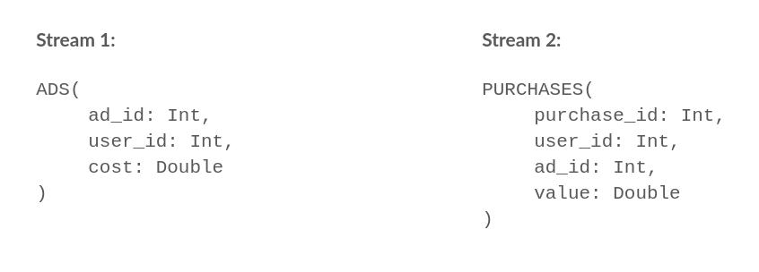
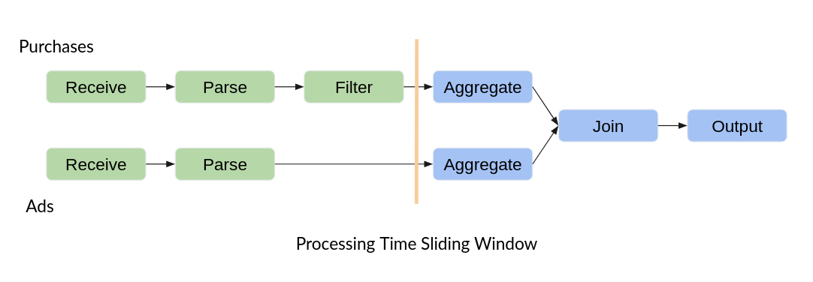
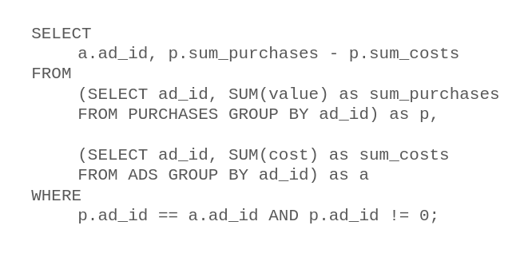

# Masterproject Winter Term 2020/2021

This repository contains the results of the master project in winter term 2020/2021 at the chair of Prof. Dr. Rabl at HPI.
The topic of this project was 'Distributed Dynamic Stream Processing'.

The following readme describes the overall structure of this project. For details about the setup please refer to the [Setup page](SETUP.md). Details concerning individual parts are documented in seperate readmes in the corresponding subdirectories. 

## Aim and structure of this project

Allthough the name of this project states differently, the main goal was to build a distributed stream processing engine based on query compilation. A dynamic query optimization was not considered in the scope of this porject.

The project was organized in 6 milestones (0 to 5). The main tasks of the individual milestones were:

0. Technical and organizational setup

1. Defining a baseline by implementing the sample use case in flink (see [flink_benchmark](flink_benchmark)) and a first approach for a stream processing engine in C++ (see [streaming_engine](streaming_engine)).

2. Hardcoded string processing with C++ for the sample use case (see [hardcoded_streaming_engine](hardcoded_streaming_engine)).

3. Based on the prototype from Milestone 2: Implementing a query compilation prototype (see [string_engine](string_engine)).

4. Making the prototype from Milestone 3 distributed (see [distributed_string_engine](distributed_string_engine)). Before doing that, a distributed variant of the hardcoded processing was implemented (see [distributed_hardcoded_streaming_engine](distributed_hardcoded_streaming_engine)).

For more details about the milestones, see the [presentation](docs/milestones.pdf).

## Structure of this repo

As described before, most subdirectories contain an implementation of some kind of stream processing engine. The following list should give a summarising overview about the role of each subdirectory:

- [distributed_hardcoded_streaming_engine](distributed_hardcoded_streaming_engine): A distributed version of [hardcoded_streaming_engine](hardcoded_streaming_engine) using OpenMPI.

- [distributed_string_engine](distributed_string_engine): A distributed version of [string_engine](string_engine) using OpenMPI.

- [docs](docs): Documentation.

- [flink_benchmark](flink_benchmark): An implementation of our sample use case using Flink.

- [fmt](fmt): Location of the git submodule referring to [{fmt}](https://github.com/fmtlib/fmt/) used in multiple projects for formatting strings.

- [generator](generator): Application used for generating the input for all stream processing engines in this repo inspired by [jeyhun_benchmark](jeyhun_benchmark).

- [hardcoded_streaming_engine](hardcoded_streaming_engine): Hardcoded implementation of our sample use case.

- [jeyhun_benchmark](jeyhun_benchmark): A data generator producing data for benchmarking purposes developed by Jeyhun Karimov.

- [streaming_engine](streaming_engine): First approach for compiling queries with C++. This approach was dropped, since the final query is build of different operators calling eachother and not -as intended- a single function.

- [string_engine](string_engine): Second approach for compiling queries with C++. In contrast to the first approach, the operators contribute their logic as strings of code, which than are concatenated to the final query, which is then compiled.

- [test_engines](test_engines): This directory contains a script and some data usable for testing the engines for correctnes, i.e. wether the desired use case is really implemented. It does not work for the distributed engines.

- [visualize_benchmark](visualize_benchmark): This direcotry contains a script, that visualizes latency and throughput for the stream processing systems in this repo using their output.

## Sample use case

We assumed a kind of mobile application where ads are displayed to the users and purchases can be made by them.
In this picture we see the two streams that are to be processed by the system.

The first stream is the advertisements deployed, with the ad that was shown and the costs for that. The ad_id is not unique, it defines the campaign, i.e. some type of ad, that is displayed.
The second stream is the purchases, which contain a reference to the original advertising campaign, as well as the costs.
There are some more fields like user_id and purchase_id we introduced for other queries that are not used in this sample workload.

The two streams enter the system and are parsed and filtered.
This is followed by a Processing Time Sliding Window,
in which the costs and revenues per ad_id are summed up.
Then the balance per ad_id is calculated in the join and the result is output.
We use a window size of 5 seconds with a slide of one second.
The workflow looks like the following:

If we write down the operation per window as a SQL query, it looks like this.

As a final result we get the profit or loss per campaign.
