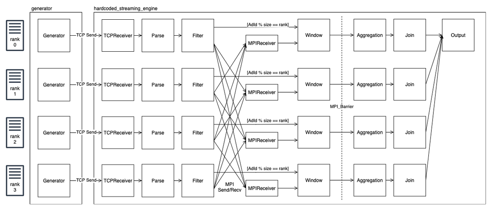
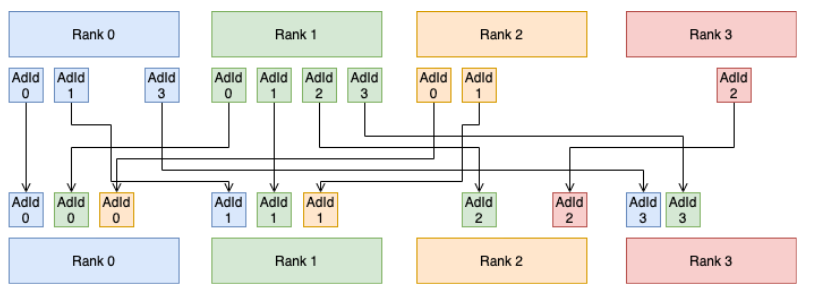
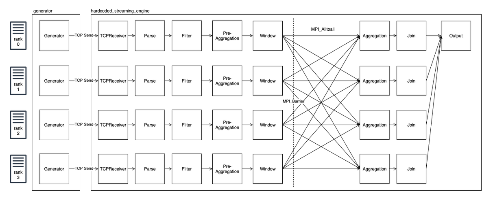

# Distributed hardcoded streaming engine

This is a distributed version of the hardcoded streaming engine. It is recomended to read the docs for the non-distributed engine first, since only the differences will be explained in detail.

## Problem statement and approaches

As described in our [sample use case](../README.md) we receive tuples, filter them and then aggregate and join them by a key. This allows an easy distribution by key, making each node ''responsible'' for a specific key range. 

As a first approach, all tuples were transmitted via OpenMPI to the target node directly after receiving. This leads to the situation, that each node sends (n-1)/n of all received tuples via network, resulting in a quite high load. Therefore we used the OpenMPI command [Isend](https://www.open-mpi.org/doc/v4.1/man3/MPI_Isend.3.php), which allows non-blocking sending. The result was somehow satisfying, since transfer speed was acceptably high.

The following picture shows the architecture at this point:


A problem we encountered was, that the processing speed of one stream (Ad Tuples) was significantly higher than the other. After trying different approaches with locking and semaphores and not gaining relevant improvement we reduced our use case to [main_simple.cpp](main_simple.cpp) and [main_simple_simple.cpp](main_simple_simple.cpp). As the weird behaiviour did not change at all, we figured that the only difference between the two streams is the size (Ad tuples have a size of 44 Byte while checkout tuples have a size of 40 Bytes). Since we do not want to ad a padding to all tuple types to make them equaly large, we looked for alternatives. 

A simple one was changing the datatype form OpenMPI Tuple to Byte. In a first draft we defined the Tuples as MPI Datatypes:
```c++
MPI_Datatype createMPIAdTupleType()
{
    const int nitems = 6;
    int blocklengths[] = {4, 4, 8, 8, 8, 8};
    MPI_Datatype types[] = {MPI_INT, MPI_INT, MPI_DOUBLE, MPI_UINT64_T, MPI_UINT64_T, MPI_UINT64_T};
    MPI_Datatype MPIAdTupleType;
    MPI_Aint offsets[] = {
        offsetof(AdTuple, adId),
        offsetof(AdTuple, userId),
        offsetof(AdTuple, cost),
        offsetof(AdTuple, eventTime),
        offsetof(AdTuple, processingTime),
        offsetof(AdTuple, numTuple)};

    MPI_Type_create_struct(nitems, blocklengths, offsets, types, &MPIAdTupleType);
    MPI_Type_commit(&MPIAdTupleType);

    return MPIAdTupleType;
}
```
We did not find a real explanation why encoding the Tuples to Bytes instead of MPI Datatypes helped but with this ''new'' approach the deviation between both streams reduced, allthough it was not gone when oversatturating the engine.

After some more investigation, research and testing we came to the conclusion, that a message passing system is not the ideal way to transmit streaming data tuple-wise. Looking for alternatives following options where evaluated:

1. Apply ''mini-batching'', i.e. collecting tuples until some time or size criterion kicks in and transmit the data in larger packages. This improved overall throughput but did not address the inital problem of transmitting large data with message passing. Additionaly it kind of destroys the streaming nature of the data.

2. Introduce a side channel, like Websockets we allready use for transmitting data from the generator to the engines. This way OpenMPI would only be used for ''handshaking'' and the real data transfer would be organized idependently. This approach was discarded, since it introduces a lot of complexity, which was previpously handled by OpenMPI.

3. Reduce the amount of data to transmit. Since we do not use any holistic aggregations in our sample use case we could use pre-aggregations, i.e. allready aggregating per key on each node, then transmit the reduced tuple to the target and node and there do the final aggregation with the partial aggregates of the other nodes. This approach has to downsides. First, our approach looses generability, since holistic aggregations like median can not be performed anymore. Second, it introduces the neccessity to synchronize the windows over individual nodes. Previously all data was transmitted as it was ready and each node coud close its windows any time (Assuming we only enably processing time windows with no global synchronization). Now there is no continous data stream anymore and therefore the sending of the partial aggregates had to be aligned with a global schedule. This might also introduce a higher latency. Despite these restrictions, we decided to implement that approach.

## Implemented solution

The decision to only transmit pre-aggregates resulted in a change in the communication scheme. Unil now, each node send individual tuples selectively/on demand to the target nodes, resulting in a more or less continous stream. Now all nodes want to send a whole bunch of data at the same point of time when a window/slide closes to all other nodes.

For this usecase OpenMPI provides the command [AllToAll](https://www.open-mpi.org/doc/v4.1/man3/MPI_Alltoall.3.php), where one can specify data for each node in an array and OpenMPI handles the distribution of parts of this array to the target nodes. Using this command, all packages send and received must have the same sice. This works for our sample use case (where each key is present in each window/slide) but is kind of difficult when thinking about larger key ranges whith a more sparse nature, where the number of keys transmitted is not constant.

Therefore we introduced a two step communication. First, each node counts how many tuples are ready to transmit for each target node. This information is exchanged using the [AllToAll](https://www.open-mpi.org/doc/v4.1/man3/MPI_Alltoall.3.php) command. Since the exact size of each datapackage to be transmitted is now known at each node, the command [AllToAllV](https://www.open-mpi.org/doc/v4.1/man3/MPI_Alltoallv.3.php) can be used. Now not every rank needs to receive the full tuple range. The following figure show an example of an AllToAllV communication:



To synchronize all nodes, we use `MPI_Barrier(MPI_COMM_WORLD);`. Therefore rank 0 is defined to be the ''master node''. While all other nodes directly reach the barrier and wait, rank 0 sleeps until the next window closes and then also reaches the barrier, resulting in the execution of the exchange procedure.

The final architecture can displayed as follows (not showing the two steps):

