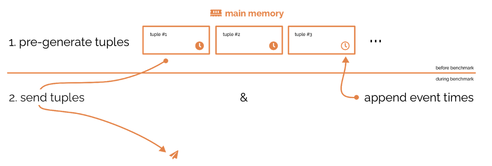

# Generator

*For information about the CLI see the usage information printed by the program itself.*

## General architecture

This application serves a data generator for benchmarking. It is inspired by the data generator written by Jeyhun Karimov, which is hosted on [Github](https://github.com/streamline-eu/StreamBenchmarks/tree/master/data-generator).

The aim of this generator is to influence the engines under test as little as possible, i.e. there should be no ocassions where the engine has to wait for the generator to produce new data. On the other side, we want to measure a correct event time latency and therefore can not pre-generate the whole tuple.

The referenced generator uses a producer/consumer model. When the (hypothetical) real world event happens, a producer thread generates sample data and appends the current timestamp. The consumer thread gets these tuples and keeps them ready for the engine to pull them. This way event time latencies are going to pile up, if the producer outputs new tuples faster than the engine pulls them.

This implementation uses a third step, since generating data on the fly in the producer sometimes was not fast enough to saturate the engines. Thatswhy, before transmitting even the first tuple, all data is pre-generated and stored in RAM. Only the event times are added later. Now, if the producer wants to produce a new tuple, it gets the next one from the buffer, appends the event time and hands it to the consumer. With this approach we where able to oberserve backpressure for all engines.

The following image summarizes this approach.

## Distributing the generator

The distribution of the generator is rather simple: There is no communication via network required. Each node/instance of the distributed engines has its own generator producing the same load. This makes implementation easy, but can have the side effect, that, for an arbitrary reason, on node is significantly faster than the others and as a result finishes early. Since most engines throw an exception, when there is no more data coming in, the experiment could end early. The other way round we could also miss on observing an significantly slower node.

These trade-offs are usually acceptable, since we are interested in the overall throughput and latency. A string engine is supposed to run for rather long time, a pipeline end is not a common practical use case. The benchmark is not influenced by this, since the throughput is measured independently from the generator.

## engineTest.cpp

This file is a ''fork'' of an earlier version of the generator used by the [engine test](../test_engines). It does not work for distributed engines.

## clientMock.cpp

This programm mocks a client for the generator. It simply receives all data the generator offers and prints some statistics. It is required to start one client mock for every stream offered by the generator.