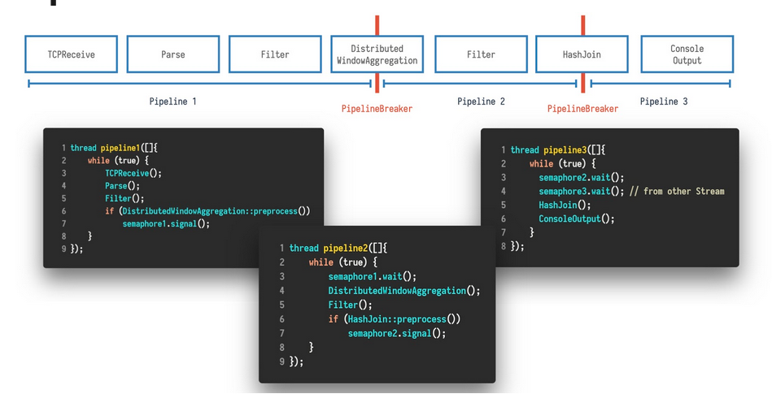

# String Engine

This is the main part of our project. It contains the streaming engine that is build on query compilation.
This prototyp is build for single node processing only. The distribution was added in [distributed_string_engine](../distributed_string_engine)

## Pipelining

The user defines the desired query in [main.cpp](main.cpp). For the pipeline an compilation process, there are three classes of major interest.

### OperatorPipe.h

This file includes the overloading of the | operator. It collects the involved operator(s) and adds it/them to the pipeline class, depending on the position of the operator in the query (first operator, two source operator, consuming operator, ...).

### Pipeline.{h,cpp}

As a result of the [OperatorPipe.h] (OperatorPipe.h), this class gets a chain of operators as input. When the compile() function is called, it iterates the operators, collects headers and query code and finally compiles the query.

A single query might consist of multiple pipelines, since all stateful operations are defined as pipeline breakers. These sub-pipelines may run idependently and therefore enable task-parallelism.

The following image visualizes this concept (Although in this engine, there is no distributed operator. The concept stays the same). 

### Schema.h

This class defines the available schema options for the user. Available aggregation methods have to be defined here too. For an example, please see the [main.cpp](main.cpp)

## Operators

The directory [operator](operator) contains everything related to actually processing data. The file [Operator.h](Operator.h) defines the different types of operators. Their names should be self-explanatory. The other classes inherit from these operator types and implement the computation logic.
